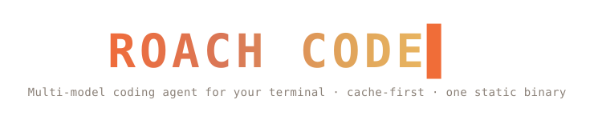

<p align="center">
  
</p>
<p align="center">
  
</p>

<p align="center">
  <strong>English</strong>
  &nbsp;·&nbsp;
  <a href="./README.zh-CN.md">简体中文</a>
  &nbsp;·&nbsp;
  <a href="./README.ko.md">한국어</a>
  &nbsp;·&nbsp;
  <a href="./docs/SPEC.md">Spec</a>
</p>

<p align="center">
  <a href="https://github.com/tmdgusya/roach-code/actions/workflows/ci.yml"></a>
  <a href="./LICENSE"></a>
  <a href="https://github.com/tmdgusya/roach-code/stargazers"></a>
  <a href="https://github.com/tmdgusya/roach-code/graphs/contributors"></a>
  <a href="https://github.com/tmdgusya/roach-code/discussions"></a>
</p>

<br/>

<h3 align="center">An AI coding agent for your terminal.</h3>
<p align="center">A config- and plugin-driven harness — a single static Go binary, tuned around prefix caching so token costs stay low across long sessions.</p>

<br/>

> **Roach Code is a multi-model rewrite of [deepseek-reasonix](https://github.com/esengine/deepseek-reasonix)** (by [@esengine](https://github.com/esengine)). It keeps the Reasonix harness and generalizes it from DeepSeek-only to *any* provider — Codex/OpenAI (Responses API + ChatGPT OAuth), MiniMax, GLM (Z.ai), Anthropic, and any OpenAI-compatible endpoint. Not a from-scratch project: a rebrand + multi-provider extension of upstream's work.

<br/>

## Features

- **Config-driven.** Providers, the agent, enabled tools, and plugins are all
  declared in `roach-code.toml`. No hardcoded models.
- **Multi-model & composable.** Any OpenAI-compatible endpoint is a config entry,
  not new code. Optionally run two models together (executor + planner) in
  separate, cache-stable sessions.
- **Plugin-driven.** External tools run as subprocesses over stdio JSON-RPC
  (MCP-compatible). Built-in tools self-register at compile time.
- **Zero-friction distribution.** `CGO_ENABLED=0` single binary; cross-compile
  to six targets with one command. The only dependency is a TOML parser.

## Install

Prebuilt binary (no Go toolchain required) — installs from the latest GitHub release:

```sh
# macOS / Linux
curl -fsSL https://raw.githubusercontent.com/tmdgusya/roach-code/main/install.sh | sh
```

```powershell
# Windows (PowerShell)
irm https://raw.githubusercontent.com/tmdgusya/roach-code/main/install.ps1 | iex
```

The installer detects your OS/arch, verifies the download against the release
`SHA256SUMS`, and drops `roach-code` (plus the short alias `roach`) on your PATH.
Override with `ROACH_VERSION`, `ROACH_REPO`, or `ROACH_INSTALL_DIR`. Or grab an
archive directly from the
[Releases](https://github.com/tmdgusya/roach-code/releases) page. Already
installed? `roach update` pulls the latest release.

### Build from source

```sh
make build      # -> bin/roach-code + bin/roach
make install    # -> ${ROACH_INSTALL_DIR:-$HOME/.local/bin}/roach-code + roach
make cross      # -> dist/ (darwin|linux|windows × amd64|arm64)
```

Local builds also create the short alias `bin/roach`; `make install` copies both
`roach-code` and `roach` to `${ROACH_INSTALL_DIR:-$HOME/.local/bin}`.

## Quick start

```sh
roach-code setup                      # config wizard → ./roach-code.toml
export DEEPSEEK_API_KEY=sk-...  # or put it in ~/.env (see .env.example)
roach-code chat                       # then run /init to generate AGENTS.md (project memory)
roach-code run "implement the TODOs in main.go"
roach-code run --model mimo-pro "add unit tests for this function"
echo "explain this code" | roach-code run
```

Installed binaries also answer to the short alias **`roach`** (e.g. `roach chat`).
A few more commands:

```sh
roach-code models                 # list configured providers / models
roach-code models refresh         # re-fetch each provider's model list from its /models API
roach-code codex login            # sign in to Codex with a ChatGPT subscription (OAuth)
roach-code update                 # self-update to the latest release
```

## Configuration

Resolution order: **flag > `./roach-code.toml` > `~/.config/roach-code/config.toml` >
built-in defaults**. Secrets come from the environment via `api_key_env` and are
never stored in config files.

```toml
default_model = "deepseek-flash"   # executor; set [agent].planner_model to add a planner
# language    = "zh"               # ui language; empty = auto-detect from $LANG / $ROACH_LANG

[agent]
# planner_model = "mimo-pro"          # optional low-frequency planner
# subagent_model = "deepseek-pro"     # optional default for runAs=subagent skills
# subagent_models = { review = "deepseek-pro", security_review = "deepseek-pro" }

[[providers]]
name        = "deepseek-flash"
kind        = "openai"
base_url    = "https://api.deepseek.com"
model       = "deepseek-v4-flash"
api_key_env = "DEEPSEEK_API_KEY"

[tools]
enabled = []   # omit/empty = all built-ins

[permissions]
mode  = "ask"                                # writer fallback when no rule matches: ask|allow|deny
deny  = ["bash(rm -rf*)", "bash(git push*)"] # hard-blocked in every mode
allow = ["bash(go test*)"]                   # never prompted

[sandbox]
# workspace_root = ""          # file-writers confined here; empty = current dir
# allow_write    = ["/tmp"]    # extra dirs write_file/edit_file/multi_edit may touch

[[plugins]]
name    = "example"
command = "roach-code-plugin-example"
```

Permissions gate each tool call: `deny` > `ask` > `allow` > fallback (readers
always allow; writers fall back to `mode`). `roach-code chat` prompts before writers
(`y` once · `a` this session · `n` no); `roach-code run` stays autonomous but still
honours `deny`. See [`docs/SPEC.md`](docs/SPEC.md) for the full schema and contract.

Permissions are *policy* (which calls to allow / prompt). The **sandbox** is
*enforcement*: the file-writers (`write_file` / `edit_file` / `multi_edit`)
refuse any path outside `[sandbox] workspace_root` (default: the current dir, so
edits stay in the project), resolving symlinks and `..` so a link can't tunnel
out. Reads are unrestricted. `bash` is itself jailed on macOS by default
(`[sandbox] bash`, Seatbelt): commands may write only those same roots (plus
temp and toolchain caches) and reach the network only when `[sandbox] network`
is set. Other platforms fall back to running unconfined for now (see
`docs/SPEC.md` §9 for the escape-prompt and Linux support still to come).

### Plugins (MCP)

Roach Code is an MCP client. A `[[plugins]]` entry's `type` selects the transport:
`stdio` (default) launches a local subprocess (`command`/`args`/`env`); `http`
(Streamable HTTP) connects to a remote `url` with optional static `headers`
(`${VAR}` / `${VAR:-default}` expanded from the environment, so tokens stay out
of the file). Tools surface to the model as `mcp__<server>__<tool>`; a tool
declaring MCP's `readOnlyHint: true` joins parallel dispatch and the permission
reader-default.

A server's **prompts** surface as `/mcp__<server>__<prompt>` slash commands
(positional args after the command); its **resources** are pulled in by writing
`@<server>:<uri>` in a message; `/mcp` lists connected servers and what each
exposes. `make build` also produces `bin/roach-code-plugin-example` — a runnable
reference stdio server (`echo`, `wordcount`, a `review` prompt, a style-guide
resource) you can copy.

```toml
[[plugins]]                       # local stdio server
name    = "example"
command = "roach-code-plugin-example"

[[plugins]]                       # remote server over Streamable HTTP
name    = "stripe"
type    = "http"
url     = "https://mcp.stripe.com"
headers = { Authorization = "Bearer ${STRIPE_KEY}" }
```

**Already have an `.mcp.json`?** Drop it in the project root and Roach Code
reads it as-is — the `mcpServers` spec (`command`/`args`/`env`, `type`/`url`/
`headers`, `${VAR}` expansion) maps field-for-field onto `[[plugins]]`. Both
sources are merged; on a name collision `roach-code.toml` wins.

```json
{
  "mcpServers": {
    "filesystem": { "command": "npx", "args": ["-y", "@modelcontextprotocol/server-filesystem", "/path"] },
    "stripe": { "type": "http", "url": "https://mcp.stripe.com", "headers": { "Authorization": "Bearer ${STRIPE_KEY}" } }
  }
}
```

### Slash commands

In `roach-code chat`, built-in commands (`/compact`, `/new`, `/rewind`, `/tree`,
`/branch`, `/switch`, `/todo`, `/model`, `/effort`, `/mcp`, `/memory`, `/help`) run locally.
`/tree` shows saved conversation branches, `/branch [name]` forks the current
conversation tip, `/branch <turn> [name]` forks from an earlier checkpointed turn,
and `/switch <id|name>` loads another branch. **Custom commands** are Markdown files under
`.roach-code/commands/` (project) or `~/.config/roach-code/commands/` (user) —
`review.md` becomes `/review`, a subdirectory namespaces it (`git/commit.md` →
`/git:commit`). The body is a prompt template; invoking the command sends it as a
turn.

```markdown
---
description: Review the staged diff
argument-hint: [focus-area]
---
Review the staged diff. Focus on $ARGUMENTS, list bugs with file:line.
```

`$ARGUMENTS` expands to all space-separated args, `$1`…`$N` to positional ones.
MCP prompts also appear here as `/mcp__<server>__<prompt>`.

### @ references

Embed `@` references in a message and Roach Code resolves them before sending, as
tagged context blocks: `@path/to/file` (or `@dir`) injects a local file's
contents (or a directory listing), and `@<server>:<uri>` injects an MCP
resource. A local path is only treated as a reference when it actually exists,
so ordinary `@mentions` stay literal. Typing `/` or `@` opens an autocomplete
menu — slash commands, or hierarchical file navigation (one directory level at a
time, descend into folders) plus MCP resources.

### Two-model collaboration (optional)

`roach-code setup` keeps first-run minimal: pick provider → keys (every SKU of a
chosen provider is enabled). Running two models together (executor + planner,
separate cache-stable sessions) is a one-line edit afterwards — set
`planner_model` to any other enabled provider:

```toml
[agent]
planner_model = "deepseek-pro"   # used as the low-frequency planner
```

Subagent skills inherit the executor model by default. Set `subagent_model` to
run them on another configured model, or use `subagent_models` to override only
specific skills such as `review` or `security_review`.


## Architecture

Three tiers of extensibility, all behind registries the core resolves by name:

1. **Registry** — `Provider` and `Tool` are interfaces; the core has no
   `switch model`.
2. **Compile-time built-ins** — providers (`provider/openai`) and tools
   (`tool/builtin`) self-register via `init()`; `main` blank-imports them.
   Adding a built-in is one file plus one import.
3. **Runtime plugins** — executables declared in config, spoken to over
   newline-delimited JSON-RPC 2.0 on stdin/stdout (the MCP stdio convention).
   Each remote tool is adapted to the `Tool` interface.

## Status

**Done:** registry-based providers/tools, OpenAI-compatible streaming with tool
calls (bounded retry on 429/5xx), built-in tools (read_file, write_file,
edit_file, multi_edit, bash, ls, glob, grep, web_fetch, task, todo_write, ask),
TOML config, an interactive `roach-code setup` wizard, two-model collaboration
(executor + planner in separate, cache-stable sessions), low-frequency context
compaction, sub-agents (`task`), a bubbletea chat TUI (markdown,
live token/activity readout, pinned task list,
`ask` question chooser, `/compact` `/new` `/tree` `/branch` `/switch` `/todo`),
session persistence + resume, per-call **permissions** (allow/ask/deny rules;
chat prompts before writers, deny rules hard-block everywhere), a **workspace
sandbox** confining file-writers to the project (symlink/`..`-safe), an MCP
client — **stdio + Streamable HTTP** transports, tools (`mcp__server__tool`,
`readOnlyHint`-aware), prompts (slash commands), resources (`@`-references),
and `/mcp`, configured via `[[plugins]]` or a project `.mcp.json` — custom slash
commands (`.roach-code/commands/*.md`), `@file` / `@resource` references, plus
a runnable reference plugin (`cmd/roach-code-plugin-example`), the harness loop,
and CLI.

**Next:** an OS-level sandbox for `bash` (macOS Seatbelt / Linux bubblewrap),
MCP OAuth + legacy SSE. See `docs/SPEC.md` §9.

<br/>

## Star History

<a href="https://www.star-history.com/?repos=tmdgusya%2Froach-code&type=date&legend=top-left">
 <picture>
   <source media="(prefers-color-scheme: dark)" srcset="https://api.star-history.com/chart?repos=tmdgusya/roach-code&type=date&theme=dark&legend=top-left" />
   <source media="(prefers-color-scheme: light)" srcset="https://api.star-history.com/chart?repos=tmdgusya/roach-code&type=date&legend=top-left" />
   
 </picture>
</a>

<br/>

<p align="center">
  <a href="https://github.com/tmdgusya/roach-code/graphs/contributors">
    
  </a>
</p>

<br/>

---

<p align="center">
  <sub>MIT — see <a href="./LICENSE">LICENSE</a></sub>
  <br/>
  <sub>Built by the community at <a href="https://github.com/tmdgusya/roach-code">tmdgusya/roach-code</a></sub>
</p>
